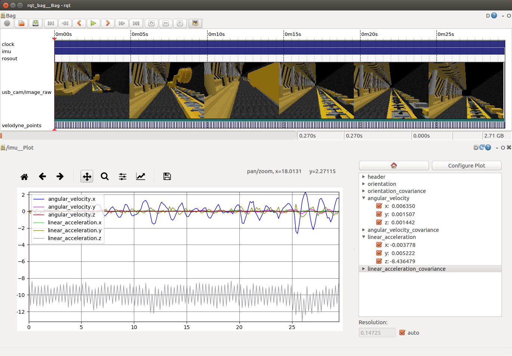

# Drone-Underground-Simulation
## 介绍
- 本项目使用了多旋翼无人机（DJI-M100原型机）进行仿真。
- 使用coppeliasim+ROS搭建，vrep中带有无人机模型与传感器（IMU、velodyne16、camera）。


## 系统配置
- ubuntu16.0.4
- ros kinetic
- coppeliasim_edu_v4
- Velodyne Plugin https://github.com/omcandido/vrep_plugin_velodyne

## 使用流程
1. roscore首先打开ros环境。
2. coppeliasim中打开项目文件`M100_Underground.ttt`操作无人机。


## 数据集
- 使用该仿真程序得到的数据集如下图所示： 
- 传感器参数、无人机模拟参数详见代码lua脚本。
- 使用如下代码可录制数据集`rosbag record -a`
- 数据回放`rosbag play *****`，下图为录制的示例数据包回放。该数据包可在该链接下载：https://pan.baidu.com/s/1eq25CfT7__1mr8R-bCgLTA 
提取码：z47k
- 该数据集中传感器频率为：（IMU:100HZ;camera:100HZ;velodyne:10HZ）
- 传感器参数及频率可在lua脚本中设置。
 

<br /> <br />
## 引用
 - 若您使用该仿真环境或数据集请引用：
 ```
 
 ```
 ## Todo
 -  完整程序将在文章录用后上传。
 ## 联系方式
 王岩 1245994265@qq.com
